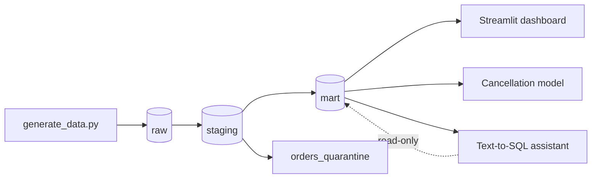

# QuickBite Analytics Platform

A small, working platform that takes generated food-delivery events all the way to an AI assistant that answers manager questions in plain English.

**Done means:** one command rebuilds the warehouse from raw data to mart tables, all tests pass, and the assistant answers 5 manager questions matching hand-written SQL.

## Architecture



- **raw**: data exactly as generated, including the bad rows
- **staging**: cleaned data, bad rows moved to `orders_quarantine`
- **mart**: `orders_fact`, `users_dim`, `restaurants_dim`

## How to run

```powershell
docker compose up --build
```

Dashboard: http://localhost:8501

Extras:

```powershell
docker compose run --rm train
docker compose run --rm assistant
```

Without Docker:

```powershell
pip install -r requirements.txt
python generator\generate_data.py
python pipeline\run_all.py
streamlit run analytics\dashboard.py
```

The assistant needs `GEMINI_API_KEY` set as an environment variable. Never commit the key.

## What is inside

| Folder | What it does |
|---|---|
| `generator/` | Makes 50k users, 500 restaurants, 500k orders, 5M events |
| `pipeline/` | raw, staging, mart, one command, logging and alert |
| `tests/` | pipeline tests and assistant tests |
| `analytics/` | 10 SQL KPI queries and the dashboard |
| `model/` | cancellation model and `predict()` |
| `assistant/` | text-to-SQL assistant (read-only) |

## The 1% bad rows (failure handled on purpose)

The generator adds about 1% bad orders (null `user_id`, negative `order_value`).
The pipeline moves them to `staging.orders_quarantine` and keeps running.
Proof: the line `Quarantined X of Y raw orders` in `logs/pipeline.log`.

<PASTE YOUR QUARANTINE LOG LINE HERE>

## Tests

- no duplicate `order_id`
- no negative prices
- every order has a `user_id` that exists in `users_dim`

If a test fails, the pipeline stops and writes a line to `logs/alerts.log`.
It also posts to Slack if `ALERT_WEBHOOK_URL` is set.

Alert demo: run with `DEMO_BREAK=1` to add a duplicate order on purpose.


## Cancellation model

Logistic regression, 80/20 train/test split, `class_weight="balanced"`.

| Metric | Value |
|---|---|
| Precision | <FILL IN> |
| Recall | <FILL IN> |

Accuracy alone is not used, because most orders are not cancelled.
Use it on a new order with `predict()` in `model/predict.py`.

## Text-to-SQL assistant

- Uses the Gemini API to turn a question into a SQL query
- Two safety layers: `is_safe()` blocks anything that is not a single SELECT, and the database connection is `read_only=True`
- Retries when the API is busy (503)

Proof that writes are impossible:


Tested on 5 manager questions against hand-written SQL: <FILL IN: 5 of 5 passed?>

## Cost and time

| Item | Notes |
|---|---|
| Cloud cost | <FILL IN, for example 0 rupees: everything ran locally> |
| Gemini API | <FILL IN, for example free tier> |
| Time spent | <FILL IN, for example Day 1: 3h, Day 2: 4h ...> |

## Known limits

- Data is synthetic, so findings are not real business insights
- The model uses simple features only
- The assistant can misread a vague question, so the schema rules matter
'@ | Set-Content -Path README.md -Encoding utf8